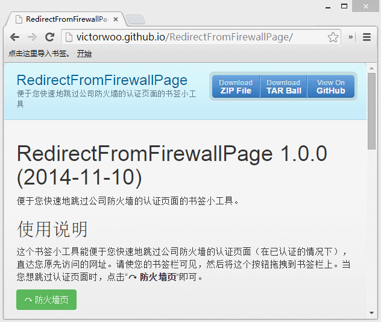
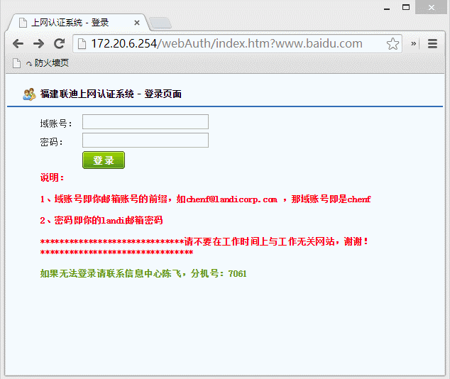

RedirectFromFirewallPage 1.0.0 (2014-11-10)
===========================================

便于您快速地跳过公司防火墙的认证页面的书签小工具。

使用说明
--------

这个书签小工具能便于您快速地跳过公司防火墙的认证页面（在已认证的情况下），直达您原先访问的网址。请使您的书签栏可见，然后将这个按钮拖拽到书签栏上。当您想跳过认证页面时，点击“__&#x21B7; 防火墙页__”即可。

<link rel="stylesheet" type="text/css" href="http://cdn.staticfile.org/twitter-bootstrap/3.3.0/css/bootstrap.min.css" />

<a href='javascript:var target;if(window.location.href.indexOf("http://172.20.6.254/webAuth/index.htm?")===0){target=window.location.search.substr(1);window.location.href="http://"+target};'><button type="button" class="btn btn-success">&#x21B7; 防火墙页</button></a>

使用效果
--------
出现防火墙页面时，点击“&#x21B7; 防火墙页”：

直达您原先访问的网址：

